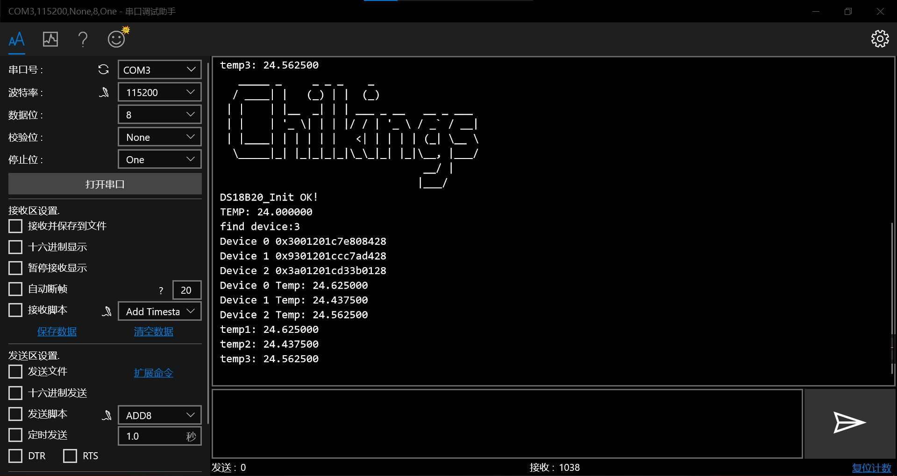

# DS18B20 驱动库带搜索功能

​	在网上搜索了很久，始终没有找到实现了搜索ROM算法的库，所以在别人写的库的基础上，成功移植并验证了DS18B20搜索ROM算法,可以一次性将总线上所有设备的ROM读取并保存。

- stm32f103c8t6 bluepill 开发板
- 使用IO口 GPIOB8

- HAL库

## 移植要点

### 实现微秒级延时函数

如果继续使用stm32单片机并使用HAL库，直接修改 CPU_FREQUENCY_MHZ 即可。其他单片机自行实现。

### 控制IO模式配置

### 控制IO操作函数

## 函数接口

| function_name            | brief                                |
| ------------------------ | ------------------------------------ |
| DS18B20_Init             | 初始化                               |
| DS18B20_GetTemp_SkipRom  | 读取温度，适用于只有一个器件         |
| DS18B20_Search_AllID     | 获取总线上所有设备的ROM              |
| DS18B20_GetTemp_MatchRom | 在匹配 ROM 情况下读取 DS18B20 温度值 |

## 示例

```c
/***********************单个ds18b20测试**********************************/

	printf("TEMP: %f\r\n",DS18B20_GetTemp_SkipRom());

/***********************单个ds18b20测试**********************************/


/***********************多个ds18b20测试**********************************/
  unsigned long long Ds18b20_ID[6]={0}; //64bit 用来存放 DS18B20 ID
  uint8_t Device_num=0; 
 
  Device_num = DS18B20_Search_AllID(Ds18b20_ID);
	printf("find device:%d\r\n",Device_num); //搜索所有设备，并把设备id存入Ds18b20_ID数组
  for(i=0;i<Device_num;i++)
  {
    printf("Device %d 0x%llx\r\n",i,Ds18b20_ID[i]);
  }
  for(i=0;i<Device_num;i++)
  {
    printf("Device %d Temp: %f\r\n",i,DS18B20_GetTemp_MatchRom((uint8_t *)&Ds18b20_ID[i]));
  }
/***********************多个ds18b20测试**********************************/
```



## 参考资料

https://github.com/imuncle/Embedded_Peripheral_Libs

https://github.com/Mculover666/HAL_Driver_Lib

以下两个文件存放在Document目录

DS18B20.pdf        

1-Wire搜索算法.pdf